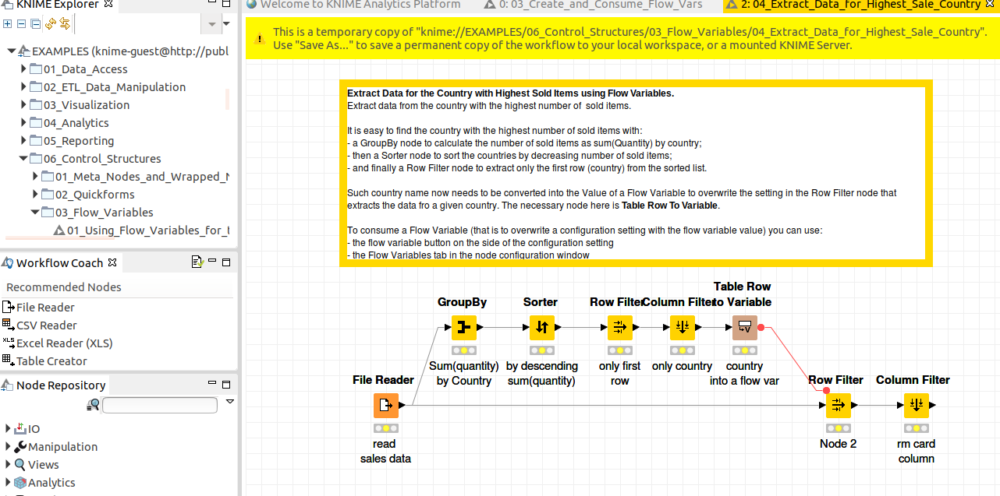

Search Guide on KNIME Resources
=== 
This file is used to list resources related to KNIME to reduce the search obstacles. Still notice it is based on the
author's experience, so errors and incompleteness can happen.

## Node General Description 
It is lised in this website, and only a general introduction, more details can be found by clicking links listed.  
https://nodepit.com/iu/org.knime.base   
For a certain node, there is an independent page for it, like  
https://nodepit.com/node/org.knime.base.node.flowvariable.tablerowtovariable.TableToVariableNodeFactory    
Second way is on the site by giving the known class name into google.  
[https://www.knime.com/docs/api/org/knime/core/data/DataTable.html]

## Source Codes for one node
Two methods exist, one is manually checked online, one is integrated into Eclipse
#### Online Search
* By checking the link name _org.knime.base.node.flowvariable.tablerowtovariable.TableToVariableNodeFactory_
from [https://nodepit.com/node/org.knime.base.node.flowvariable.tablerowtovariable.TableToVariableNodeFactory ] 
which is mentioned above, 
* we go to github  
https://github.com/knime  
* And then go to the specified path of those repositories. 
* Here is the sources code !!
#### Search In Eclipse 
https://www.knime.com/developer/faq#q2_1 

## Developer Tutorials
Overview tutorials are posted under the link  
[https://www.knime.com/developers]. Some examples are listed there. 

## Forum for Developer
[https://forum.knime.com/c/knime-development]  
This forum is for KNIME developers, it's helpful to propose questions, but sometimes it might not be so precise. 

## Workflow helper inside KNIME
 
In this image, the examples workflow is given. We can search for certain use of one node, or use this workflow
as a template.

## Connect it With Additional Library   
To use existing plugins in KNIME development, we need to create an additional library with pm4knime-libs. 
The procedure is under the README.md file. but sometimes there are some exceptions.
Ivy will download jars for ProM online into ~/.ivy2/cache/* (On my computer) 

## Google, of course, when you have no idea!!
